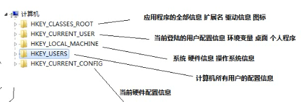
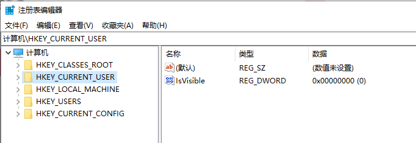
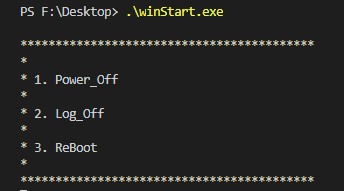
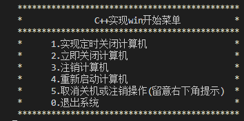

# winStartFunction

C++实现windows注销、关机和重启等操作

**一、方法一：利用系统注册表实现**

1.在命令行输入 regedit 即可查看系统注册表

2.系统注册表目录说明

3.实现代码

    winStart.cpp

4.运行演示，用户输入相关数字即可进行相关操作。

**二、方法二：利用windows系统自带命令实现**

1.实验代码见文件：

    winStart2.cpp

2.运行效果：

参考文章：【1】[C/C++控制Windows关机/注销/重启的正确姿势](https://blog.csdn.net/PeterZ1997/article/details/79933189)

                 【2】[C++ 实现系统注销，重启，关机的方法](https://blog.csdn.net/flyingleo1981/article/details/73162081)
